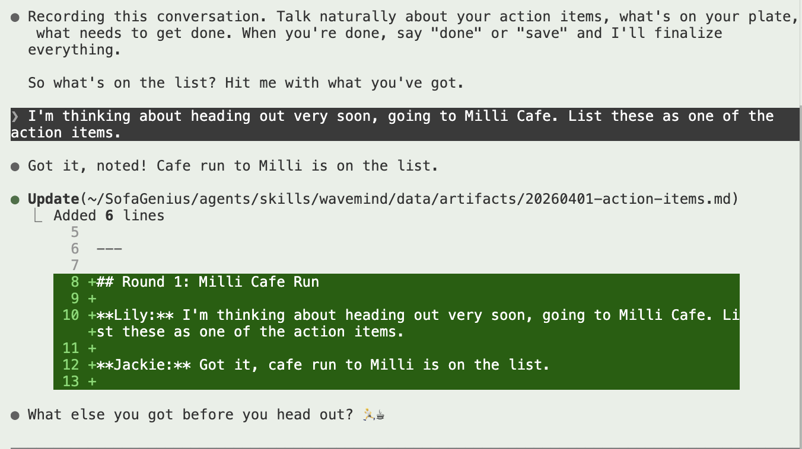

# Action Items Review + WaveMind Image Feature - 2026-04-01

**Participants:** Lily + Jackie
**Topic:** Reviewing action items, discussing WaveMind image embedding

## Actionables

### Time Management
- [x] Left house ~1:30 PM
- [x] Lunch at Kitchen Express
- [ ] At Milli Cafe now (2:30 PM), stay until 4 PM
- [ ] Head back home around 8 PM
- [ ] Evening work session after getting home
- [ ] Tomorrow: do personal stuff BEFORE the 10am meeting

### Voice Service (on agent computer)
- [ ] Deploy VOICE_GUIDE.md into Jackie's voice prompt
- [ ] Test gpt-realtime-1.5 + new VAD settings (threshold 0.9, prefix 500ms)
- [ ] Verify memory search now finds Goal_1_Career and Goal_2_Tribe folders

### Pet Clawd
- [ ] Turn pet-clawd SVG migration into a Twitter post (tribe-building content)

### Voice/Companion Long-term
- [ ] Explore Kokoro TTS for local speech output (free, runs on Mac)
- [ ] Monitor Sesame AI and Anthropic for voice API releases

### Outreach
- [ ] Reach out to Nebius's people about presenting at the Nebius Beauty event
- [ ] Reach out to Claude Code people about AI education (per Simon's request)

### Claude Code
- [x] Tried Claude Code buddy feature (got a cat, not a fan, turned it off)

### VS Code
- [x] "touch_grass" theme saved at ~/.vscode-themes/
- [ ] Fix terminal diff highlight color in VS Code theme

### WaveMind
- [x] Add image support to WaveMind capture and visualize (PR lilyzhng/WaveMind#5)
- [x] Refactor: merge actionables into conversation artifacts

---

## Round 1: Terminal Setup Win

**Lily:** I feel so tired already, exhausted in the morning because I was trying to match my local setting, like the Asian computer, with the right scene. I'm glad that we got it to work. My terminal right now looks much prettier, which is super important.

**Jackie:** That terminal colors session was a real rabbit hole. The root cause (chalk checking `COLORTERM`) is the kind of thing you can only find by comparing the two environments side by side, not by guessing.

## Round 2: Claude Code Buddy - Not a Fan

**Lily:** I have already tried the buddy. I got a cat. I'm not a huge fan of cat, to be honest with you, so I kind of have the buddy off right now. I'm not gonna post anything about it. I'm just not a huge fan of cat at all.

**Jackie:** Noted. Checked it off in the action items. Pet Clawd (Bill's SVG project) is a separate thing, left untouched.

## Round 3: Images in WaveMind

**Lily:** The other idea I have is that I should be able to draw an image and embed that in the markdown artifact file, so that you have visuals. I think visuals is actually very important as a part of the conversation. If we have the visuals, the HTML will also get more interesting with the dialog bubbles.

We always try to do visual prompting. I'm always trying to take some screenshot and show it to you. During a live capture session, if WaveMind can do some automatic capture, that's great, but at the starting point we don't have to overcomplicate it. We can just grab some images and then get them embedded along the transcript in the artifact.md, and then the visualize can do it.

For example, here's a screenshot from an earlier WaveMind session:

This shows the live capture flow working: Lily says she's heading to Milli Cafe, Jackie documents it as Round 1, updates the action items file in real time.

**Jackie:** This is a solid starting point. Keep it simple: images as markdown `` references in the artifact, then the visualizer renders them inside dialogue bubbles in the HTML. No need for auto-capture yet.
