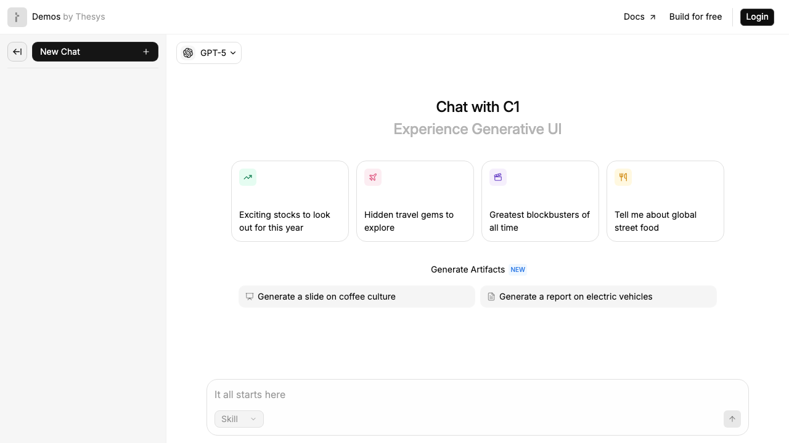
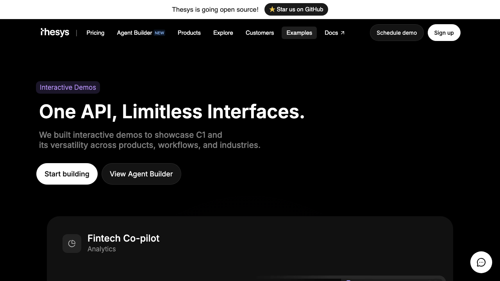
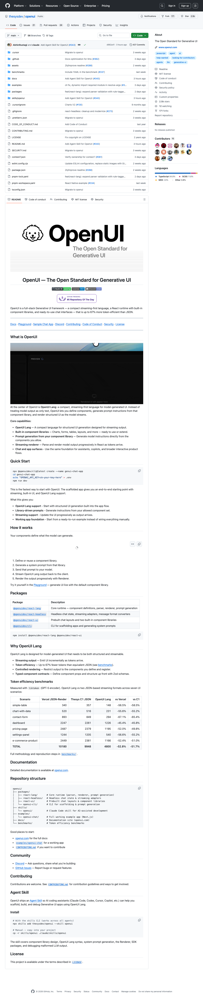

# Generative UI Framework Research

## Screenshots

### Thesys C1 Chat Demo — "Chat with C1, Experience Generative UI"

*Live demo at demo.thesys.dev/chat — shows prompt cards for stocks, travel, movies, street food + artifact generation (slides, reports). Uses GPT-5 by default, supports multiple LLMs.*

### Thesys Examples Page — "One API, Limitless Interfaces"

*Interactive demos including Fintech Co-pilot (analytics), C1 Web Search, C1 Chat, and C1 Canvas.*

### OpenUI GitHub Repo — 2.5k stars, open-source framework

*Full-stack generative UI framework — streaming-first language, React runtime, 67% more token-efficient than JSON.*

## Origin

Lily found a generative UI framework via Twitter and flagged it as exciting. She has existing relationships in this space — chatted with Joy from Modal a few days ago, and Cat Wu from Anthropic is also interested.

- Original tweet: https://x.com/i/status/2036149934441783691

> **Note on data quality:** All claims below are from vendor pages, blog posts, or press releases unless marked otherwise. No independent verification yet.

## TL;DR

Generative UI is converging on open standards in early 2026. Thesys C1 launched mid-2025, OpenUI and the AG-UI protocol landed in March 2026. Three major approaches are now converging: **Thesys/OpenUI** (streaming-first language for generating UI components), **CopilotKit/AG-UI** (protocol for agent-to-frontend communication), and **Google A2UI** (agents describing UI needs as structured JSONL). The space is moving from "cool demo" to "enterprise infra." Lily has connections to people at Modal and Anthropic who are tracking this — potential networking + product opportunity.

---

## Part 1: Key Players

### Thesys (thesys.dev) — "The Generative UI Company"

**What it does:** API middleware (C1) that sits between your app and any LLM. Instead of returning plain text, the LLM returns structured UI components (forms, tables, charts, layouts) that render in real-time via a React SDK.

**How C1 works:**
1. Developer swaps their LLM endpoint URL to C1 (OpenAI-compatible)
2. C1 intercepts the LLM response and structures it as UI components
3. C1 React SDK renders the components live as tokens stream in
4. Supports custom React components and design systems (via Crayon)

**Key technical details:**
- OpenAI-compatible endpoint — drop-in replacement (vendor-claimed)
- Multi-LLM: works with OpenAI, Anthropic, Google models
- Supports tool calls for database/API integration
- Enterprise: zero data retention, GDPR/SOC2/ISO27001 compliant (vendor-claimed)

**Team:** Founded 2024 by Rabi Shankar Guha and Parikshit Deshmukh. Team includes former Google, Stripe, Salesforce engineers.

**Pricing:**
| Tier | Cost | API Calls | Notes |
|------|------|-----------|-------|
| Free | $0 | 5K/mo | + $10 LLM credits |
| Build | $49/mo | 25K/mo | $0.002/call overage |
| Grow | $499/mo | 500K/mo | $0.001/call overage |
| Scale | Custom | Custom | Self-host/VPC option |

LLM inference costs passed through at provider rates (no markup).

### OpenUI (github.com/thesysdev/openui) — The Open Standard

**What it is:** Open-source full-stack generative UI framework by Thesys. Launched March 2026.

**Core innovation — OpenUI Lang:**
- Compact, streaming-first language for model-generated UI
- Up to **67% more token-efficient than JSON** (vendor-benchmarked)
- Progressive rendering as LLM tokens arrive
- Built-in component libraries (charts, forms, tables, layouts)
- Typed component contracts using Zod schemas

**Token efficiency benchmarks (vendor-claimed):**
| UI Type | Reduction vs JSON-Render |
|---------|------------------------|
| Simple table | 56.5% fewer tokens |
| Contact form | 67.1% fewer tokens |
| Average across 7 scenarios | 52.8% fewer tokens |

**GitHub stats (as of 2026-03-23):** 2.5k stars, 171 forks, 437 commits, TypeScript-based

**Claude Code integration:** OpenUI includes a Claude Code Agent Skill for scaffolding, building, and debugging generative UI apps.

### CopilotKit / AG-UI Protocol

**What it is:** Open protocol standardizing how AI agents communicate with frontends in real-time.

**March 12, 2026 joint release:** Oracle + Google + CopilotKit aligned three specs:
- **Open Agent Specification** (Oracle) — define agent behavior framework-agnostically
- **AG-UI** (CopilotKit) — standardize live agent-to-frontend interaction streams
- **A2UI** (Google) — agents describe UI needs as structured JSONL, frontends render natively

**Why it matters:** This is the "HTTP of agent UIs" — a standard protocol so any agent can talk to any frontend without vendor lock-in.

---

## Part 2: How They Compare

| Dimension | Thesys/C1 | OpenUI | CopilotKit/AG-UI | v0 (Vercel) | Claude Artifacts |
|-----------|-----------|--------|-------------------|-------------|-----------------|
| **Approach** | API middleware | OSS framework | Protocol standard | Code generation | Inline rendering |
| **Output** | Live UI components | Streaming UI lang | Agent-frontend bridge | Static code | HTML/React in chat |
| **Runtime vs buildtime** | Runtime | Runtime | Runtime | Buildtime | Runtime |
| **Token efficiency** | Via OpenUI Lang | 52-67% better than JSON | N/A (protocol) | Standard JSON | N/A |
| **Open source** | No (API) | Yes | Yes | No | No |
| **LLM support** | Multi-LLM | Multi-LLM | Multi-agent | Multi-LLM (originally OpenAI) | Claude only |

**Key distinction:** v0 and Bolt generate code at development time. Thesys/OpenUI generate UI at runtime — the interface adapts to every user interaction, not just at build time. Claude Artifacts is runtime but limited to the chat window.

---

## Part 3: Relevance to SofaGenius

### Why this matters to us

1. **Our agents produce reports and research** — currently as markdown in handoff files. Generative UI could turn those into interactive dashboards, filterable tables, and visual comparisons. Instead of reading my sandbox research report as a markdown file, imagine it as a live comparison tool.

2. **Content/product opportunity** — Lily has direct connections (Joy at Modal, Cat Wu at Anthropic). Both companies are interested in this space. This could be a collaboration, content, or integration opportunity.

3. **OpenUI has a Claude Code skill** — immediate integration path for our agents. We could use it to generate interactive research reports or data visualizations.

### Potential use cases
- **Research reports as interactive UIs** — filter, sort, compare products dynamically
- **Data exploration** — DuckDB query results rendered as live charts/tables
- **Agent dashboards** — what did your agents do today, visualized
- **Content demos** — show don't tell, interactive examples for social posts

### What I don't know yet
- **The original tweet was not readable** — X requires JS which WebFetch can't execute. The research below is based on web search and product pages, not the specific content Lily saw. Lily: what specifically caught your eye in that tweet? It may point to a product or angle I missed.
- Whether Joy at Modal or Cat Wu at Anthropic are working with Thesys specifically or the broader generative UI space
- Whether OpenUI's token efficiency claims hold in production
- How well C1 handles complex, nested UI generation

---

## Part 4: Suggested Next Steps

### For Lily (networking)
- [ ] Follow up with Joy at Modal — ask what they're building with generative UI
- [ ] Connect with Cat Wu at Anthropic — OpenUI already has Claude Code integration
- [ ] Consider a "generative UI for AI agents" content angle — we have a real use case

### For Researcher (technical evaluation)
- [ ] Try OpenUI Claude Code skill — install and test with a research report
- [ ] Benchmark token efficiency against raw markdown output
- [ ] Test C1 API free tier (5K calls/mo) with a sample data visualization

### For Builder (if we decide to integrate)
- [ ] Evaluate OpenUI React SDK for potential agent dashboard
- [ ] Assess whether our existing frontend could use C1 as a drop-in

---

## Sources

### Primary
- https://www.thesys.dev — Thesys product page
- https://www.thesys.dev/pricing — Pricing details
- https://github.com/thesysdev/openui — OpenUI open source repo (2.5k stars)
- https://www.copilotkit.ai/blog/introducing-ag-ui-the-protocol-where-agents-meet-users — AG-UI launch
- https://x.com/i/status/2036149934441783691 — Original tweet (Lily's find)

### Secondary
- https://www.copilotkit.ai/blog/the-developer-s-guide-to-generative-ui-in-2026 — CopilotKit's landscape overview
- https://blogs.oracle.com/ai-and-datascience/announcing-agent-spec-for-a2ui-copilotkit-ag-ui — Oracle/Google/CopilotKit joint release
- https://www.infoworld.com/article/3971182/thesys-introduces-generative-ui-api-for-building-ai-apps.html — InfoWorld coverage
- https://www.businesswire.com/news/home/20250418761213/en/Thesys-Introduces-C1-to-Launch-the-Era-of-Generative-UI — Thesys C1 launch press release
